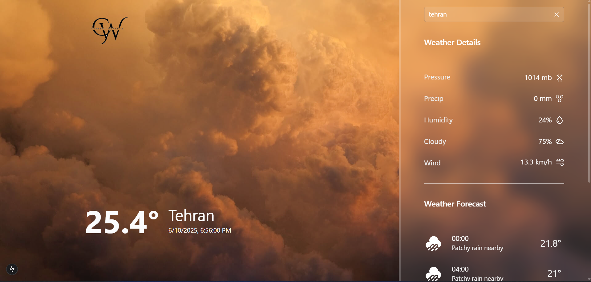

# About The Project

This project is a weather application that allows users to view real-time weather information. With this application, users can:

- View current temperature in real-time
- See detailed weather conditions updated instantly
- Get weather forecasts for upcoming hours
- Access important information such as humidity, wind speed, and atmospheric pressure with live updates

The project is built using modern web technologies and features a beautiful, user-friendly interface that makes the experience enjoyable.

## Built With

The technology that I used in making this project:

## Getting Started

This is an example of how you may give instructions on setting up your project locally. To get a local copy up and running follow these simple example steps.

### Prerequisites

This is an example of how to list things you need to use the software and how to install them.

`npm install npm@latest -g`

### Installation

_Below is an example of how you can instruct your audience on installing and setting up your app. This template doesn't rely on any external dependencies or services._

**1.Get a free API Key at** https://www.weatherapi.com/

**2.Clone the repo**

`git clone https://github.com/ProfessorMR/current-weather.git`

**3.Install NPM packages**

`npm i`

**4.Enter your API_KEY and BASE_URL in services/WeatherService.js**

`const API_KEY = 'ENTER YOUR API';`
`const BASE_URL = 'ENTER BASE URL';`

## Contact

Mohammad Ramaji: [instagram](https://instagram.com/mohammad._.rmj)
Project Link: [currentWeather](https://github.com/ProfessorMR/current-weather.git)

## Acknowledgments

I would like to give credit to the original UI design that inspired this project:

- [Original Design on templatemonster](https://weather-web-9uot.onrender.com/)

Thank you for your amazing design and inspiration!
